# Using the API from Swagger UI — step by step

*Version française : [api-guide.fr.md](api-guide.fr.md)*

This walkthrough follows one migration from an empty API to a promoted
clone, entirely through the browser. Every screenshot below is a real
capture of the real API — none of them is a mockup, and they are regenerated
from the code by `tools/capture_swagger_guide.py`.

> **About the tokens and cluster names in the screenshots.** They come from a
> throwaway demo store created during the capture and destroyed immediately
> after. `SuperAdmin-Demo-Token`, `DEMO-TOKEN-finance-only`, `clu-prod-01`…
> are fictional and valid nowhere. The capture runs with the **dry-run
> transport**: no ONTAP cluster is ever contacted to produce this guide.

**Contents**

1. [Reaching Swagger UI](#1-reaching-swagger-ui)
2. [The API starts locked](#2-the-api-starts-locked)
3. [The landing page](#3-the-landing-page)
4. [Authenticating](#4-authenticating)
5. [Delegating tokens to clients](#5-delegating-tokens-to-clients)
6. [Checking feasibility before acting](#6-checking-feasibility-before-acting)
7. [Creating the cascade](#7-creating-the-cascade)
8. [Following a running migration](#8-following-a-running-migration)
9. [Per-qtree actions: test, clone, acl](#9-per-qtree-actions-test-clone-acl)
10. [What a scoped token can and cannot do](#10-what-a-scoped-token-can-and-cannot-do)
11. [Reading the answers](#11-reading-the-answers)

---

## 1. Reaching Swagger UI

Open `http://<api-server>:8000/docs`.

If nothing answers, the API is bound to `127.0.0.1` (the installed default),
which means *reachable from the API server only*. Either tunnel from your
workstation:

```bash
ssh -L 8000:127.0.0.1:8000 <user>@<api-server>
# then open http://127.0.0.1:8000/docs locally
```

or start the API with `--host 0.0.0.0` once the port is firewalled properly.

The Swagger assets are served by the API itself (`/static/`), so the page
works on a server with no Internet access.

---

## 2. The API starts locked

The token store is decrypted in memory only. After every start — including
`systemctl start` — the API is **locked**: the port is bound and Swagger UI
loads, but every endpoint answers `503`.

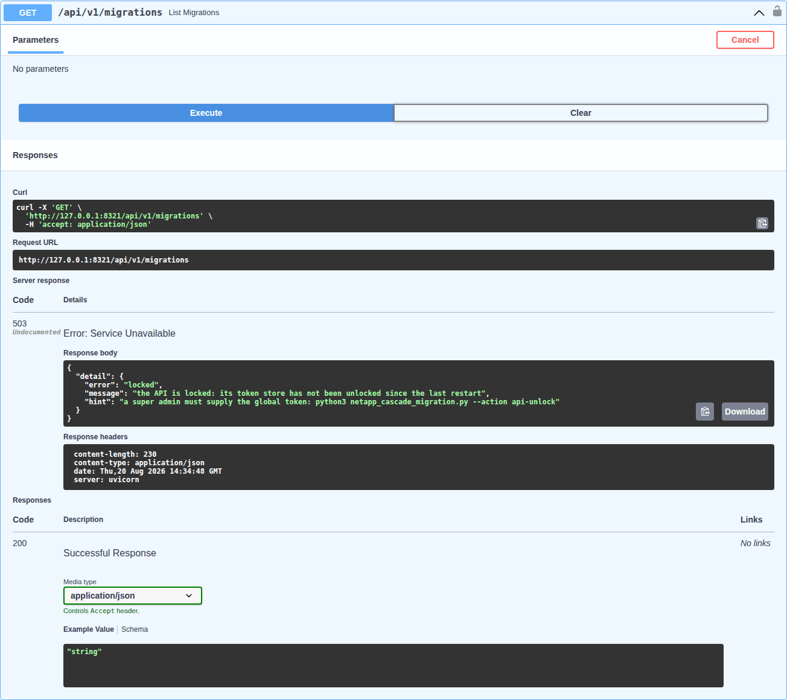

The body says exactly what to do:

```json
{
  "detail": {
    "error": "locked",
    "message": "the API is locked: its token store has not been unlocked since the last restart",
    "hint": "a super admin must supply the global token: python3 netapp_cascade_migration.py --action api-unlock"
  }
}
```

A super admin unlocks it from a shell **on the API server** — this is the one
step that cannot be done from the browser, by design: the global token never
travels over HTTP.

```bash
python3 netapp_cascade_migration.py --action api-unlock \
    --unlock-socket /opt/netapp-migration/etc/unlock.sock
#   Global token (super admin): ********
#   API unlocked (unlocked, 3 delegated token(s)).
```

Reload the page afterwards.

> Running the API in the foreground instead (`python3 -m
> netapp_migration.interfaces.api.serve`) makes it prompt for the token
> before it binds the port; there is nothing to unlock in that case.

---

## 3. The landing page

Once unlocked, `/docs` lists everything the API can do.

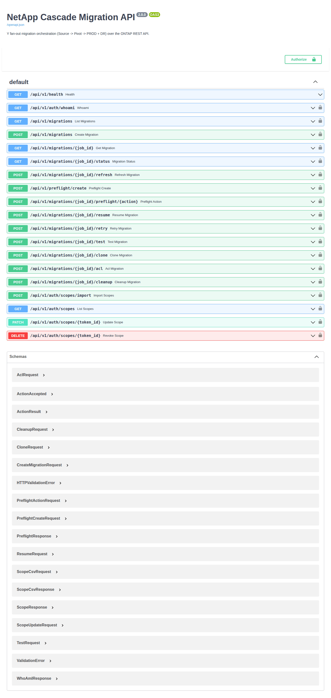

Read it as four families:

| Family | Endpoints | Who |
|---|---|---|
| Authentication | `/auth/whoami`, `/auth/scopes*` | super admin |
| Migration life cycle | `/migrations`, `/migrations/{job_id}`, `…/resume`, `…/retry`, `…/refresh` | super admin |
| Per-qtree work | `…/test`, `…/clone`, `…/acl`, `…/cleanup` | client tokens, within their scope |
| Feasibility | `/preflight/create`, `…/preflight/{action}` | anyone with the matching scope |

---

## 4. Authenticating

Every endpoint except `/health` needs a token. Without one you get `401`:

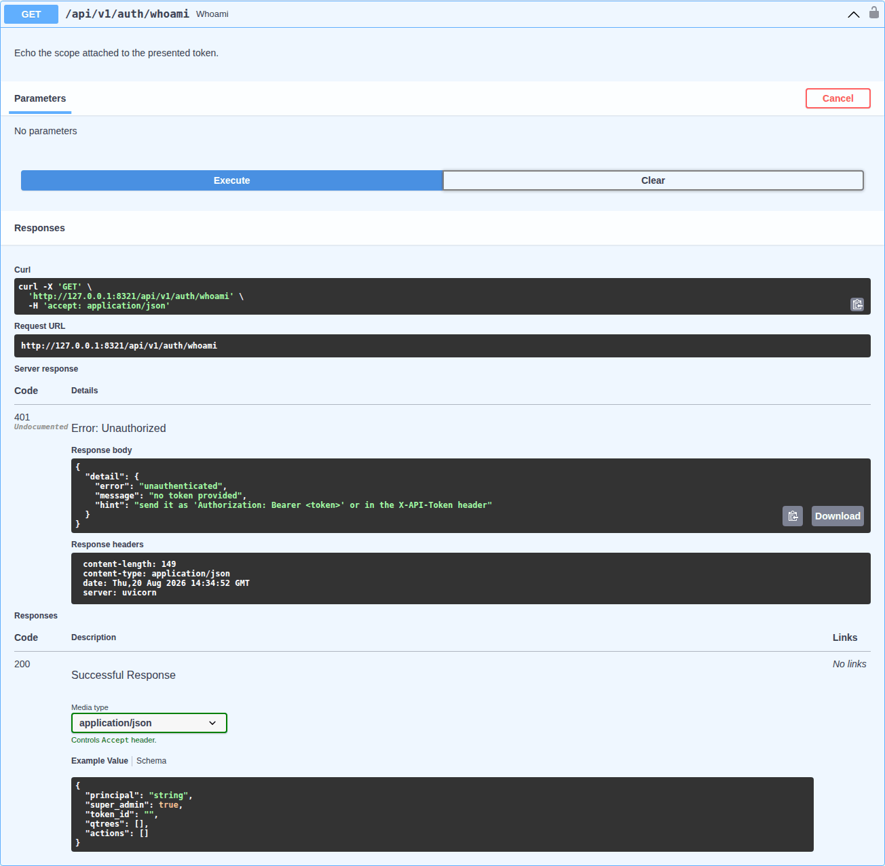

Click **Authorize** (top right), paste the token, then **Authorize** again
and **Close**. Swagger UI now attaches `Authorization: Bearer …` to every
call you make from this page.

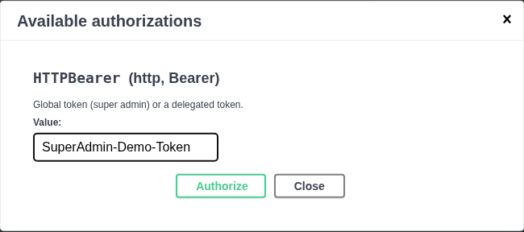

Check who you are with `GET /api/v1/auth/whoami`. Click the operation,
**Try it out**, then **Execute**:

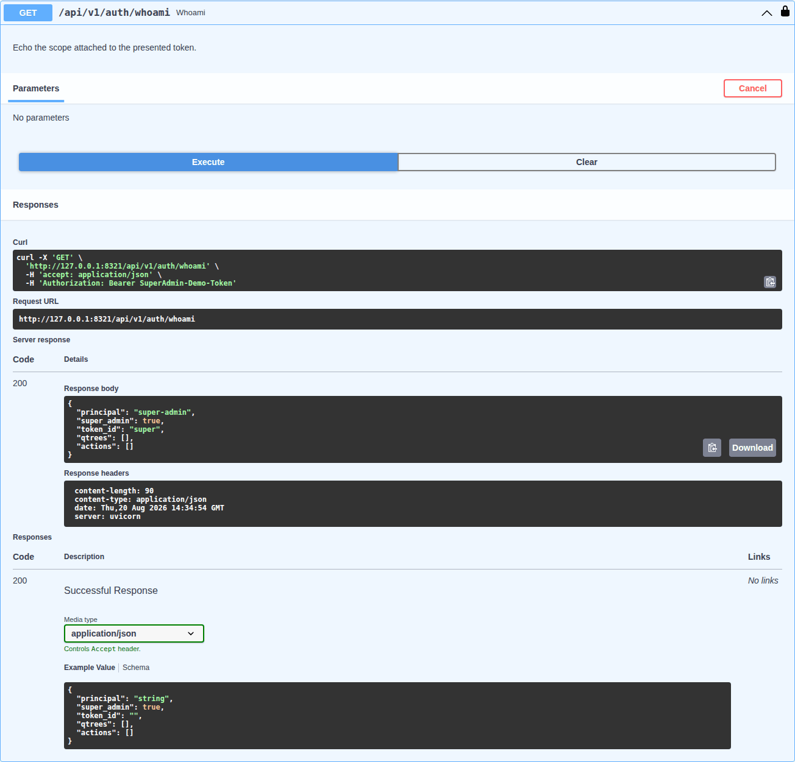

`"super_admin": true` means the global token was accepted: no restriction on
actions or qtrees. A delegated token answers with its own `qtrees` and
`actions` lists instead.

`GET /api/v1/health` needs no token at all — use it to check that the API is
up *and* unlocked:

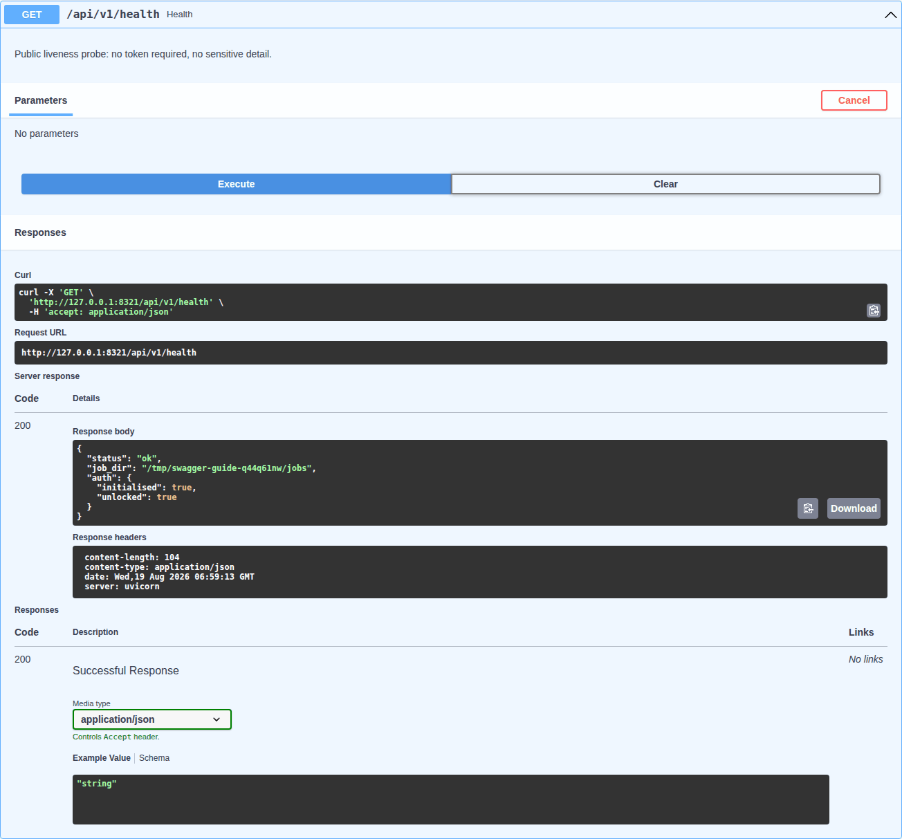

---

## 5. Delegating tokens to clients

Only the super admin can do this. `POST /api/v1/auth/scopes/import` takes a
CSV of `qtree,token,actions[,label]`. Write `NEW_TOKEN` in the token column
and the API generates one:

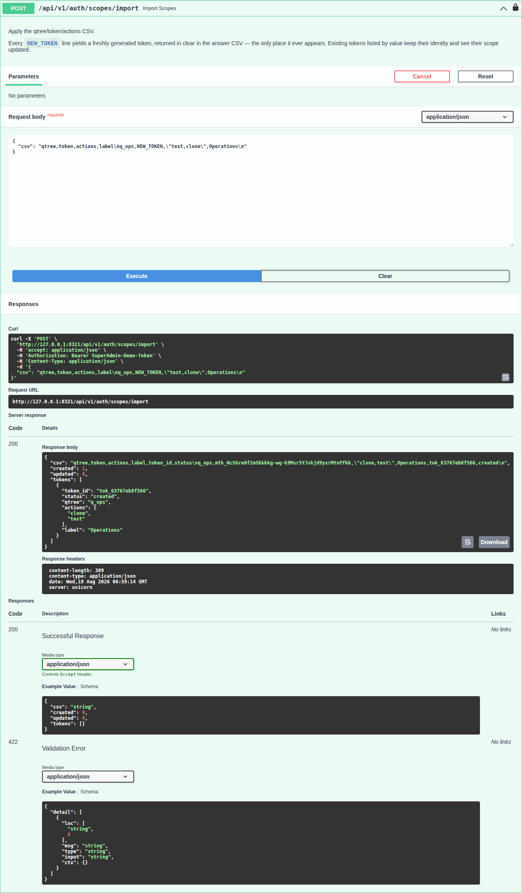

The answer echoes a CSV containing the **generated tokens in clear** — this
is the only time they are ever readable. Hand each one to its owner and do
not keep the response; the store itself only ever holds salted hashes.

`GET /api/v1/auth/scopes` lists what exists, without ever showing a token:

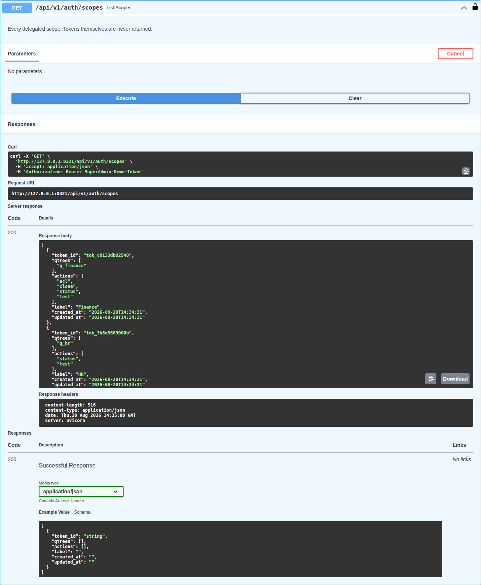

Scopes can be changed later with `PATCH /auth/scopes/{token_id}` and revoked
with `DELETE /auth/scopes/{token_id}`.

---

## 6. Checking feasibility before acting

Every action verifies its own prerequisites before touching anything, and
each check can also be run on its own. `POST /api/v1/preflight/create`
answers with a report and changes nothing:

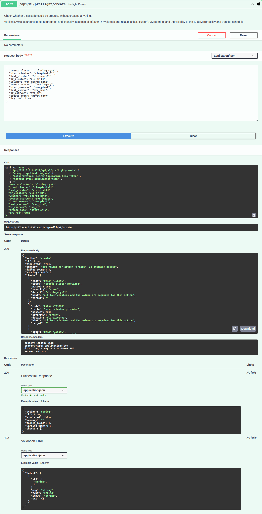

Read `ok` first (plus `failed_count` / `warning_count`), then the `checks`
list. Each entry carries a stable `code`, a human `title`, what was actually
observed (`detail`), the `target` it was looking at, and a `hint` when there
is something to do about it. A failing check tells you *why*, not just *no*:

```json
{
  "code": "SVM_MISSING",
  "title": "Pivot SVM exists",
  "passed": false,
  "severity": "error",
  "detail": "vserver 'svm_pivot' not found on clu-pivot-01",
  "hint": "create the SVM or fix the --*-vserver parameter",
  "target": "clu-pivot-01 / svm_pivot"
}
```

`severity` matters: `error` blocks the action, `warning` does not. A common
warning is `*_UNREADABLE` — the object may well exist, but the API account's
ONTAP role cannot read it, so the check could not conclude. Its `hint` names
the missing grant (for example `grant readonly on /api/svm/peers`).

The same endpoint exists per action and per job:
`POST /api/v1/migrations/{job_id}/preflight/{action}` with `action` being
`resume`, `retry`, `test`, `clone`, `acl` or `cleanup`.

---

## 7. Creating the cascade

`POST /api/v1/migrations` starts the migration. The pre-flight runs
**synchronously first**: a refusal comes back as `422` with the same report
as above, and nothing is created. Only when it passes does the work start in
the background and the call answers `202`:

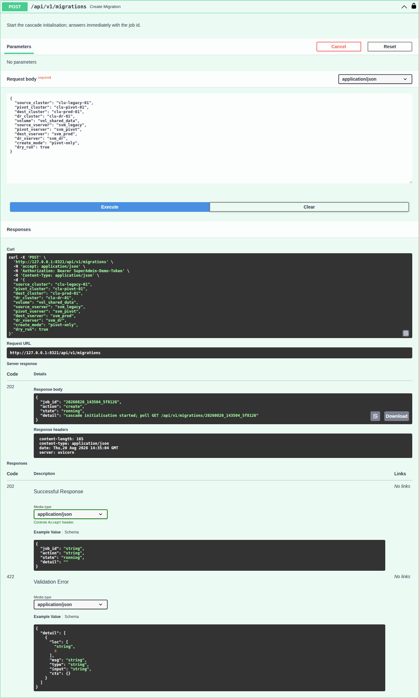

Keep the `job_id` from the answer — every later call needs it.

Two fields worth knowing:

* `create_mode`: `pivot-only` sets up Source → Pivot and stops there;
  `full` goes all the way to PROD and DR.
* `dry_run`: `true` simulates everything, contacts no cluster and writes no
  job state. Use it to rehearse a run. *(Every screenshot in this guide was
  produced this way.)*

---

## 8. Following a running migration

`GET /api/v1/migrations` lists the known jobs:

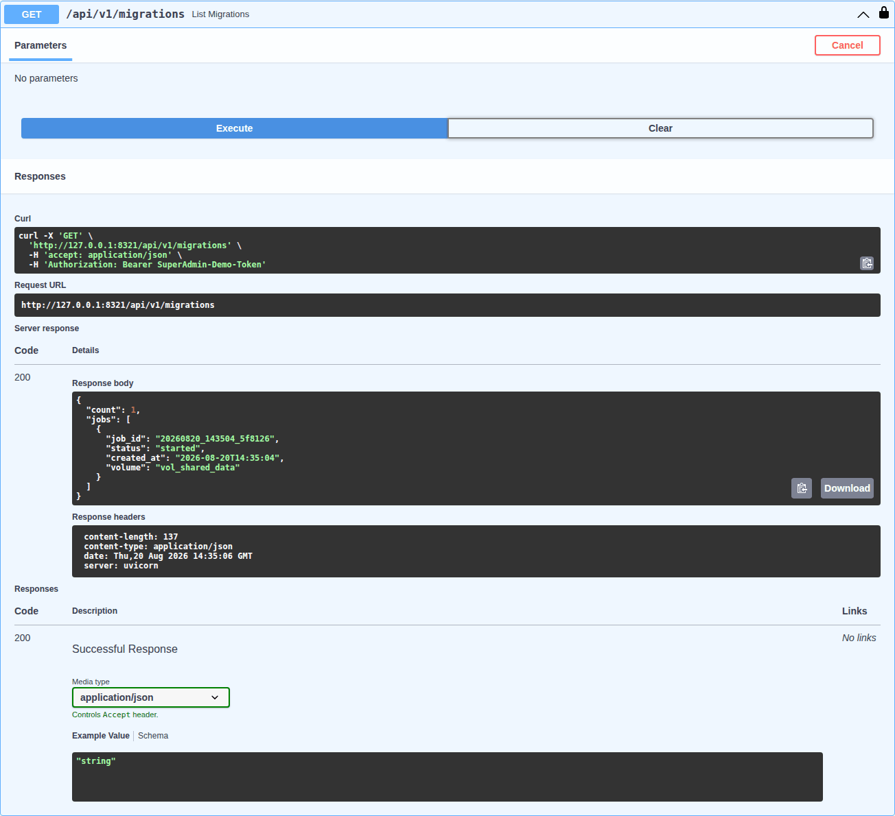

`GET /api/v1/migrations/{job_id}/status` gives the live state — paste the
`job_id` into the field, then **Execute**:

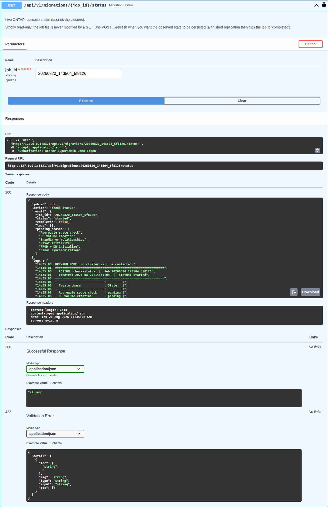

The status reports the SnapMirror relationships in explicit terms
(`MIRROR_HEALTHY`, `TRANSFER_ACTIVE`, `TRANSFER_FAILED`, `MIRROR_BROKEN`,
`MIRROR_ABSENT`) rather than raw ONTAP strings, plus the checkpoint the job
has reached. `POST …/refresh` re-reads the clusters and rewrites the job
file; `POST …/resume` continues a job that stopped at a checkpoint, and
`POST …/retry` re-runs the failed phase.

---

## 9. Per-qtree actions: test, clone, acl

These are the operations a client token is allowed to run, within its own
scope.

### test — build the full future environment, reversibly

`POST /api/v1/migrations/{job_id}/test` creates the FlexClones on the future
PROD **and** DR and the SnapMirror relationship between them — everything
except the split and the volume move. The client can validate access and
permissions on a real environment; nothing is committed.

Check it first with `preflight/test`:

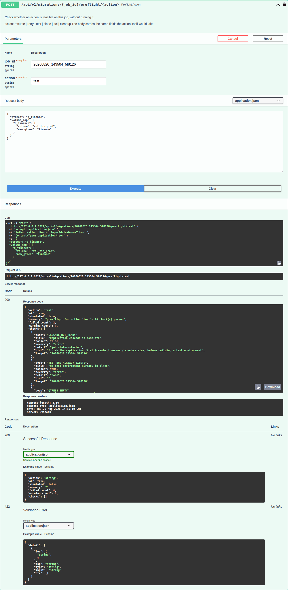

Then run it:

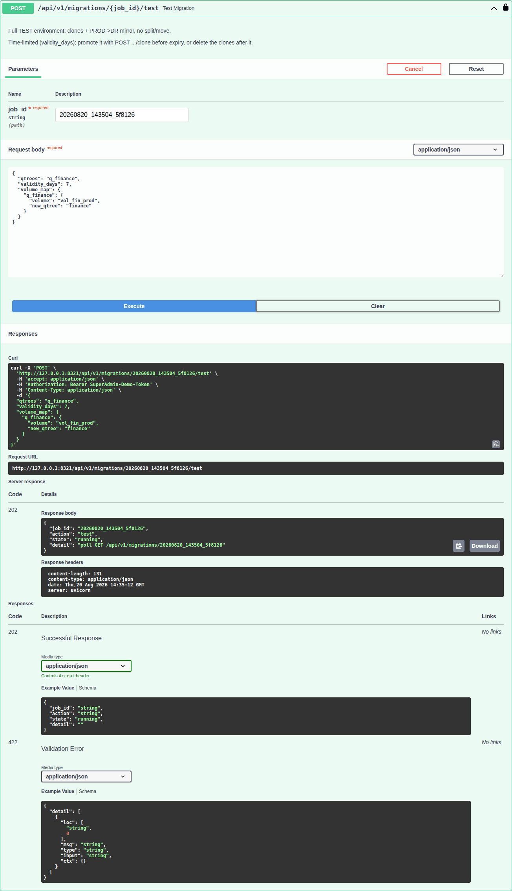

`volume_map` gives, for each qtree, the name of the volume to create — the
client chooses it, nothing is auto-generated. It is required: a qtree without
a name fails pre-flight with `VOLUME_MAP_MISSING`. A later `clone` inherits
the mapping recorded in the job file by `test`, so it only needs repeating
when it changes. Three shapes are accepted, pick whichever is convenient:

```json
{"volume_map": {"q_finance": "vol_fin_prod"}}
{"volume_map": [{"qtree": "q_finance", "volume": "vol_fin_prod"}]}
{"volume_map": "qtree,volume\nq_finance,vol_fin_prod\n"}
```

`validity_days` (default 7) records when the test environment expires.

### clone — promote the test environment

`POST /api/v1/migrations/{job_id}/clone` before expiry **promotes** what
`test` built: it only performs the volume moves that detach the clones from
their parent. Nothing is rebuilt.

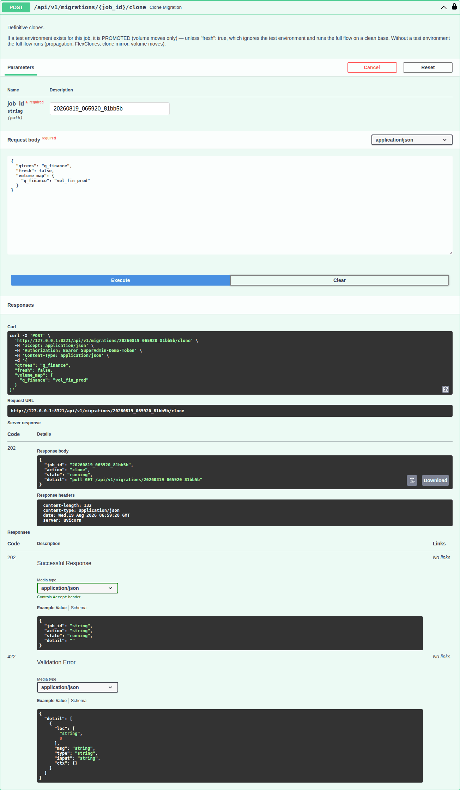

`"fresh": true` ignores an existing test environment and runs the full flow
on a clean base — the old test clones stay on the clusters and are listed at
the end of the run for manual deletion.

### acl — force AD groups onto a path

`POST /api/v1/migrations/{job_id}/acl` is completely independent of
test/clone and acts on **one explicit path**:

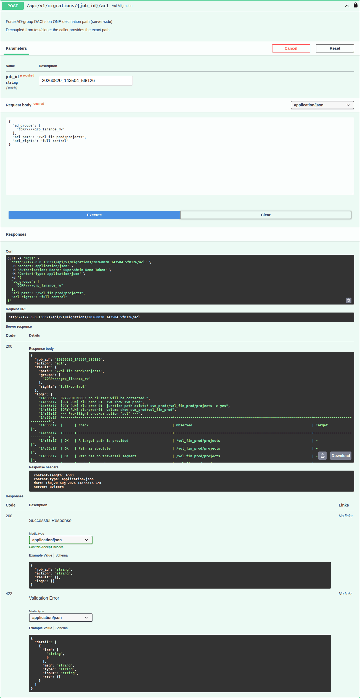

Backslashes must be escaped in JSON: `"CORP\\grp_finance_rw"`.

---

## 10. What a scoped token can and cannot do

Authorize again with a delegated token to see enforcement from the client's
side:

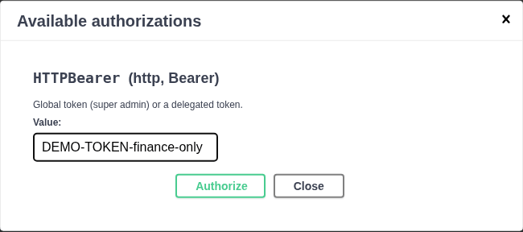

A qtree outside the token's scope is refused with `403`, and the answer shows
what the token *does* have — so the client can tell whether they mistyped or
were never granted it:

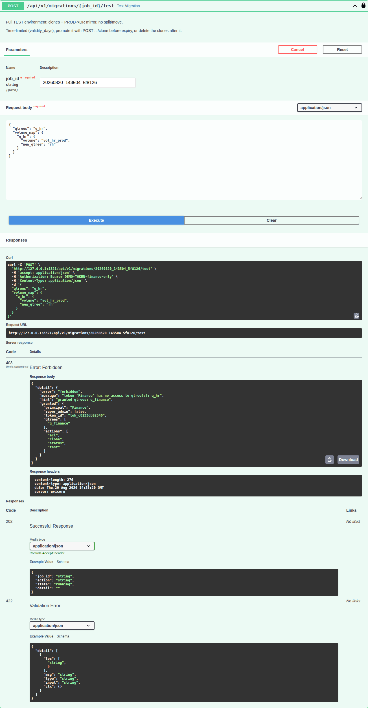

Reserved actions are refused the same way. `create`, `resume`, `retry`,
`refresh` and token administration are super-admin only, whatever the
token's qtree scope:

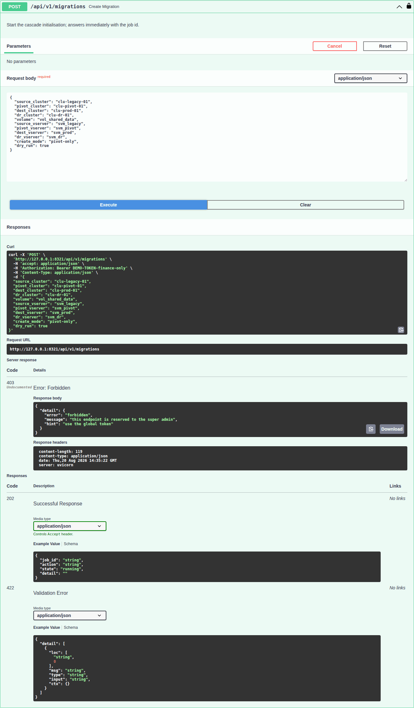

---

## 11. Reading the answers

| Code | Meaning | What to do |
|---|---|---|
| `200` | done, synchronous action | — |
| `202` | accepted, running in the background | poll `GET …/status` |
| `401` | no token, or an unknown one | click **Authorize** |
| `403` | authenticated, but out of scope | the body lists the granted scope |
| `404` | unknown `job_id` | check `GET /api/v1/migrations` |
| `409` | another action is already running on this job | wait, then poll the status |
| `422` | pre-flight refusal, or a malformed body | read `checks`: nothing was changed |
| `503` | API locked, or no token store | unlock it (section 2) |

A `422` from pre-flight always has this shape:

```json
{
  "detail": {
    "error": "preflight_failed",
    "message": "pre-flight for action 'clone': 2 check(s) failed (SVM_MISSING, CLUSTER_PEER_MISSING)",
    "action": "clone",
    "failed_checks": [ { "code": "SVM_MISSING", "passed": false, "severity": "error", "detail": "...", "hint": "..." } ],
    "warnings": [ ... ],
    "checks": [ ... ],
    "hint": "no cluster was modified; fix the failed checks and retry"
  }
}
```

`failed_checks` holds only what blocks you — start there. `checks` carries the
full report, passed checks included.

Nothing is ever half-done because of a `422`: the checks run before the first
write.

---

## Regenerating this guide

The screenshots are produced from the code, against a real running instance,
so they cannot silently drift from the API:

```bash
python3 -m pip install playwright pillow     # browsers are pre-installed
python3 tools/capture_swagger_guide.py
```

It starts an API on port 8321 with a temporary token store and the dry-run
transport, drives Chromium through the whole walkthrough, writes
`docs/images/*.png`, and deletes everything it created. Re-run it whenever
the API surface or the Swagger version changes.
