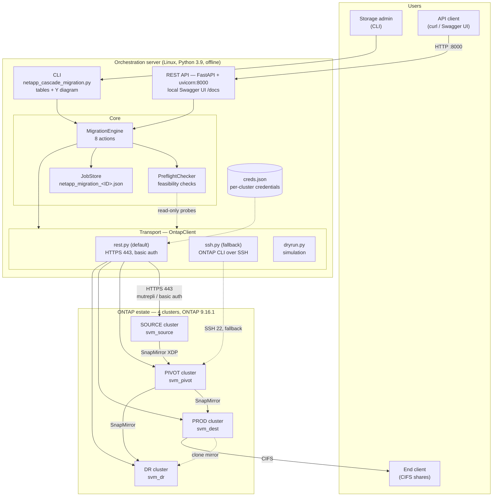
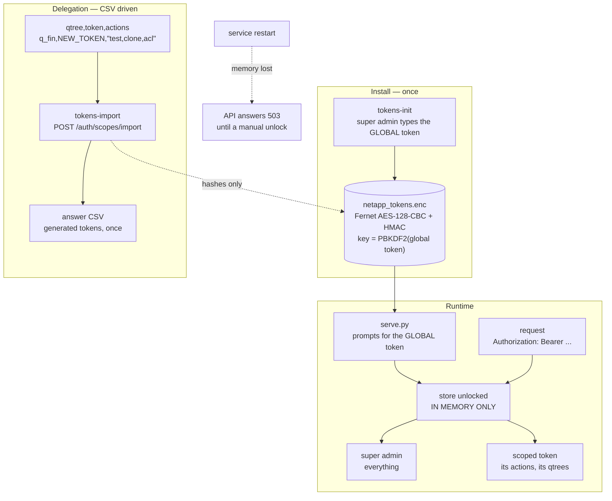
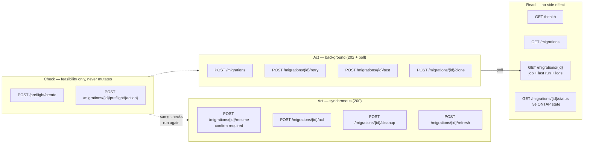
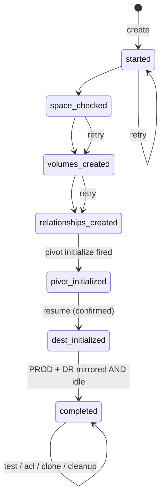
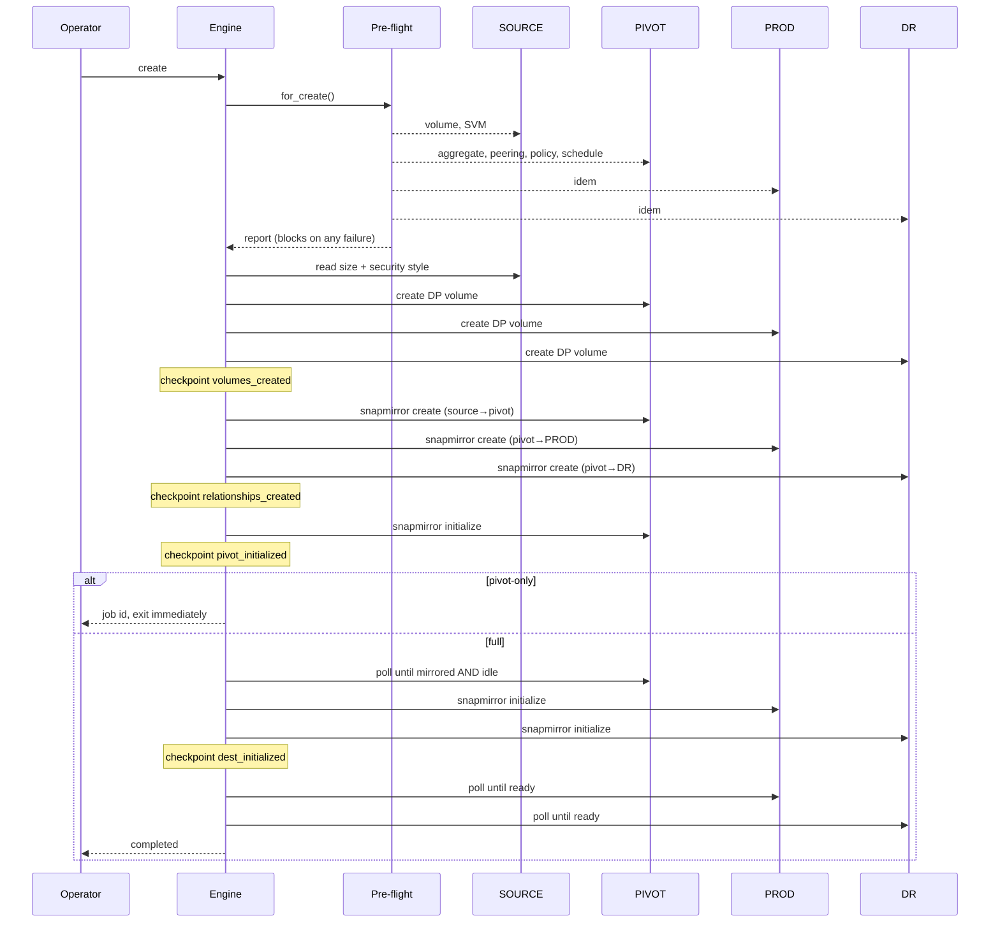
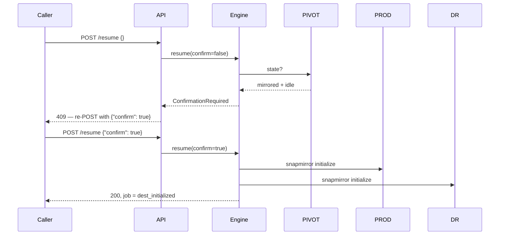
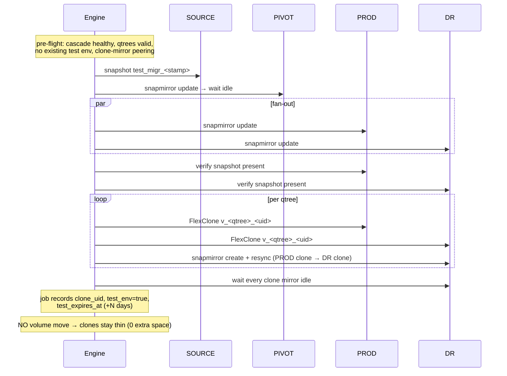
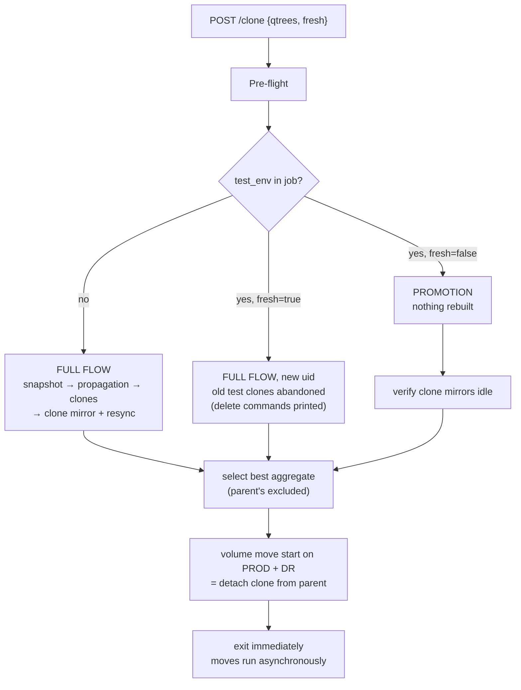
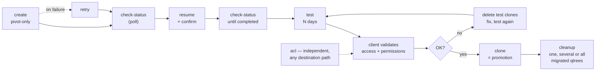

# Architecture & workflow

*Companion to [README.md](../README.md). Diagrams are Mermaid: they render on
GitHub and in most Markdown viewers.*

---

## 1. Overall architecture



Both interfaces call the **same engine**; the engine reaches clusters only
through the **OntapClient** contract, so swapping REST for SSH changes no
business logic. State lives in **JSON job files** — no database, no broker;
background work runs in threads of the uvicorn process.

---

## 1bis. Authentication and scopes



**The global token** is typed by the super admin at install time and again at
every start of the service. It is never written anywhere: it is the key
material of the store (PBKDF2-HMAC-SHA256, 600 000 iterations) and doubles as
the super-admin API token. Lose it and the store cannot be recovered.

**Delegated tokens** are stored as salted hashes only. A generated token
appears in clear exactly once, in the answer CSV. The store file also holds
no qtree name in clear — the whole payload is encrypted.

**Scope model**

| Action | Who |
|---|---|
| `create`, `resume`, `retry`, `refresh`, token administration | super admin only — they act on the whole cascade |
| `test`, `clone`, `acl`, `cleanup` | delegable, restricted to the token's qtrees |
| `status`, `preflight`, `read` | delegable, read-only |

A scoped token that names a qtree outside its grant gets `403` with the list
of what it does hold. Scopes change at any time with the super-admin token
(`PATCH /auth/scopes/{id}`) without re-issuing the token.

**Restart policy** — the decrypted store lives only in memory, so a restart
of the service leaves the API locked (`503`) until a super admin supplies the
global token again on the command line. That is deliberate: an unattended
restart must not silently re-open the API.

---

## 2. What the API can do



### Endpoint reference

| Method | Endpoint | Purpose | Answers |
|---|---|---|---|
| `GET` | `/api/v1/health` | service liveness + auth state — **public** | `200` |
| `GET` | `/api/v1/auth/whoami` | scope of the presented token | `200` `401` |
| `POST` | `/api/v1/auth/scopes/import` | apply the qtree/token/actions CSV — **super admin** | `200` `422` |
| `GET` | `/api/v1/auth/scopes` | list delegated scopes (never the tokens) — **super admin** | `200` |
| `PATCH` | `/api/v1/auth/scopes/{id}` | change a scope dynamically — **super admin** | `200` `400` |
| `DELETE` | `/api/v1/auth/scopes/{id}` | revoke a token — **super admin** | `204` `400` |
| `GET` | `/api/v1/migrations` | list jobs | `200` |
| `GET` | `/api/v1/migrations/{id}` | job record, last run state, log tail, last pre-flight report | `200` `404` |
| `GET` | `/api/v1/migrations/{id}/status` | live replication state — **read-only**, never writes the job | `200` `404` `502` |
| `POST` | `/api/v1/migrations/{id}/refresh` | same as above **and** persists a finished replication | `200` `404` |
| `POST` | `/api/v1/preflight/create` | can a cascade be created? | `200` |
| `POST` | `/api/v1/migrations/{id}/preflight/{action}` | is this action feasible? (`resume`, `retry`, `test`, `clone`, `acl`, `cleanup`) | `200` `400` `404` |
| `POST` | `/api/v1/migrations` | create the cascade | `202` `422` |
| `POST` | `/api/v1/migrations/{id}/resume` | fan out to PROD + DR | `200` `409` `422` |
| `POST` | `/api/v1/migrations/{id}/retry` | resume a failed create | `202` `422` |
| `POST` | `/api/v1/migrations/{id}/test` | build the test environment | `202` `422` |
| `POST` | `/api/v1/migrations/{id}/clone` | definitive clones (promotion / fresh / full) | `202` `422` |
| `POST` | `/api/v1/migrations/{id}/acl` | force AD-group DACLs on one path | `200` `422` |
| `POST` | `/api/v1/migrations/{id}/cleanup` | cut source access for one, several or all migrated qtrees | `200` `422` |

### Status codes and what they mean

| Code | Meaning | What to do |
|---|---|---|
| `200` | done, `result` carries the outcome | — |
| `202` | accepted, running in background | poll `GET /migrations/{id}` |
| `400` | unknown action name | fix the URL |
| `404` | no such job | check the job id / job directory |
| `409` | another action is running on this job, **or** confirmation required | wait, or re-POST with `{"confirm": true}` |
| `401` | missing, unknown or revoked token | present a valid token |
| `403` | the token's scope does not cover this action or qtree | ask the super admin to widen the scope |
| `503` | the token store is locked (service restarted) or not initialised | a super admin must restart the service with the global token |
| `422` | **pre-flight refused the action — nothing was modified** | fix the listed checks, retry |
| `502` | ONTAP failed during execution | read `detail`, check the log file |
| `500` | unexpected failure | read the log file |

### Shape of a 422 (the important one)

Every refusal itemises what was verified, what was observed and how to fix it:

```json
{
  "detail": {
    "error": "preflight_failed",
    "message": "pre-flight for action 'create': 2 check(s) failed (SCHEDULE_MISSING, SVM_PEER_MISSING)",
    "action": "create",
    "failed_checks": [
      {
        "code": "SCHEDULE_MISSING",
        "title": "DR: transfer schedule visible",
        "passed": false,
        "severity": "error",
        "detail": "schedule 'hourly' not visible to the API user",
        "hint": "job schedule cron create -name hourly -minute 5, or grant readonly on /api/cluster/schedules",
        "target": "CMOPARDC5SFS100 / hourly"
      }
    ],
    "warnings": [],
    "checks": [ "… every check, passed ones included …" ],
    "hint": "no cluster was modified; fix the failed checks and retry the same call"
  }
}
```

---

## 3. Pre-flight coverage per action

Nothing is attempted before these are satisfied. Codes are stable and safe to
consume by automation.

| Action | What gets verified |
|---|---|
| `create` | all parameters present; four **distinct** clusters; the 4 SVMs exist and run; source volume exists (size + security style read); the 3 aggregates exist and have room; the 3 DP volumes do **not** already exist; **cluster peering + SVM peering** on the 3 legs; SnapMirror **policy and schedule visible** on each destination cluster; the 3 relationships do **not** already exist |
| `resume` | job is exactly at `pivot_initialized`; pivot mirrored **and** idle; PROD/DR volumes exist; PROD/DR relationships declared and **not already initialized** (blocks a double initialize) |
| `retry` | job status recognised; for phases still to run, the same peering / policy / schedule checks as `create` |
| `test` | cascade complete and **healthy on all three legs**; **no test environment already in place**; qtrees exist on the source and are unique; derived clone name is a legal ONTAP volume name; peering + policy + schedule for the clone mirror PROD→DR |
| `clone` (promotion) | requested qtrees **exactly match** the test set; each clone exists on PROD and DR; each clone mirror is healthy and idle; validity not expired (warning); a move-target aggregate exists other than the parent's |
| `clone` (full/fresh) | same as `test`, plus the move-target aggregate check; `--fresh` warns that the old test clones are abandoned |
| `acl` | path provided, absolute, no traversal, **not `/`**; path belongs to a **clone volume of this job**; path resolves on the PROD SVM; volume security style is NTFS/mixed; AD group syntax |
| `test` / `clone` naming | **every qtree has an explicit target volume name**; names are distinct; each is a legal ONTAP volume name; each is free on PROD **and** DR |
| `cleanup` | at least one qtree, existing on the source, no duplicate, no path separator; migration `completed`; the qtree is in the job's `volume_map` and the migrated volume is present on PROD **and** DR; not already cleaned up (`_MIG_`); the new name is free; clones promoted (warning); **explicit preview of the exact CIFS shares** that will be deleted |

---

## 4. Migration workflow

### 4.1 Life cycle



A checkpoint is written **immediately after** each phase, so `retry` resumes
exactly where it stopped and skips completed phases (creates are idempotent).

### 4.2 create — full mode



The strict rule: **PROD and DR are never initialized before the pivot is
mirrored and idle**, then both start back-to-back (Y fan-out).

### 4.3 resume — confirmation gate



### 4.4 test — full environment, no split



### 4.5 clone — three modes



### 4.6 End-to-end operational sequence



---

## 5. Known limitations

These are deliberately **not** addressed by the pre-flight work and remain open:

* **The API has no authentication** — every endpoint is anonymous. Do not
  expose port 8000 beyond a trusted host; put an authenticated reverse proxy
  in front, or wait for the auth lot.
* **No cluster allowlist** — cluster names come from the request and the
  `defaults` credentials would be sent to any host named. Keep the API closed
  until this is fixed.
* **`transport=ssh` is still accepted by the API**, and SSH commands
  interpolate identifiers without ONTAP-specific escaping.
* **No per-resource locking** — two jobs targeting the same volume can run
  concurrently; only one action per job id is serialised.
* **Volume moves are launched, not tracked** — `clone` exits once the moves
  start, by design; their completion is not verified by the tool.
* **The CLI is driven by the super admin only.** Delegated tokens are meant
  for the REST API; they cannot open the local encrypted store.
* **Clones contain every qtree of the source volume.** A FlexClone copies the
  whole parent, so after the move each target volume holds all the source
  qtrees — a data-segregation and capacity issue that needs a product
  decision (prune the other qtrees after the move, or expose only the right
  one through the CIFS share).
